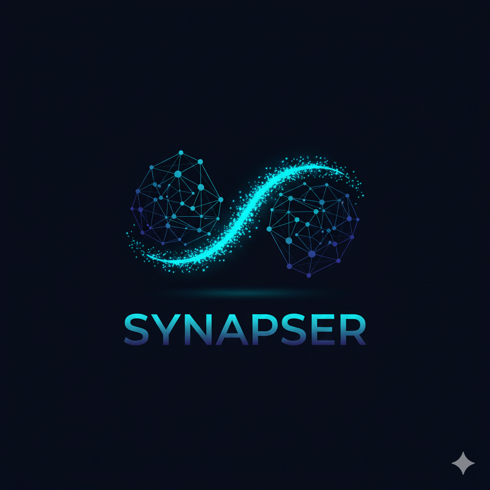

#  Synapser

> **Reconnecter l'esprit.**
> Plateforme Open-Source de Réhabilitation Neuronale & Neurofeedback.


---

## 📑 À propos (Abstract)

**Synapser** est une solution open-source de réhabilitation neuronale par neurofeedback pour traiter les acouphènes. Connectée à un casque EEG Bluetooth, notre écosystème (App Mobile et extension VR) propose des exercices thérapeutiques en temps réel. Elle inclut un dashboard d'analyse de données permettant aux chercheurs de suivre l'évolution de la neuroplasticité des patients.

### 🔗 Liens Rapides
- [🌐 **Voir la Landing Page du Projet**](https://synapser-teasing.vercel.app/)
- [🎬 **Voir la Vidéo de Présentation**](https://www.youtube.com/watch?v=iZueQg5KT5M)

---

## 🛠 Architecture & WBS (Work Breakdown Structure)

Ce projet est découpé en 5 piliers techniques distincts pour garantir la maintenabilité et la scalabilité.

### 1. Synapser Hardware Bridge (IoT) 🧠
> *Le pont entre le cerveau et la machine.*
- **1.1 Driver Bluetooth (BLE) :** Gestion de la communication bas-niveau avec le casque EEG.
- **1.2 Signal Processing Engine :** Algorithmes de normalisation, FFT et filtrage des artefacts musculaires.

### 2. Core Application (Mobile & Web) 📱
> *L'interface patient pour la thérapie au quotidien.*
- **2.1 Module Auth & Profil :** Sécurisation des données patients.
- **2.2 Neurofeedback Engine :** Boucle temps réel traduisant les ondes (Alpha/Delta) en UI réactive.
- **2.3 Gamification :** Système de progression pour favoriser l'assiduité.

### 3. Immersive Module (VR Extension) 🥽
> *L'expérience d'isolation sensorielle ultime.*
- **3.1 Environnements 3D Thérapeutiques :** Scènes Zen réactives (Unity/Unreal).
- **3.2 Connecteur WebSocket :** Streaming de données EEG vers le moteur 3D.

### 4. Backend & Data Infrastructure ☁️
> *La mémoire du projet pour la recherche médicale.*
- **4.1 API Sécurisée (Node.js) :** Conformité aux standards de données de santé.
- **4.2 Time-Series DB :** Stockage optimisé des logs de sessions.
- **4.3 Research Dashboard :** Outil de visualisation pour les cliniciens.

### 5. Project Management 🚀
- **5.1 CI/CD & Tests :** Pipeline d'intégration continue.
- **5.2 Documentation :** Specs techniques et User Guides.

---

## 🔬 Description Fonctionnelle & Enjeux

### Acquisition de Signal (IoT)
**L'enjeu :** Garantir une latence < 50ms. Le cerveau doit voir le résultat de son activité instantanément pour que le conditionnement opérant fonctionne.

### Boucle Neurofeedback
**L'enjeu :** Implémenter des protocoles cliniques validés (ex: Alpha/Delta training) pour traiter réellement les acouphènes et non juste "visualiser" de la donnée.
*Référence scientifique : [Tinnitus treatment via Neurofeedback (ScienceDirect)](https://www.sciencedirect.com/science/chapter/bookseries/abs/pii/S0079612307660464)*

### Immersion VR
**L'enjeu :** Découpler le rendu graphique (lourd) du traitement de signal (critique) via une architecture WebSocket, permettant d'utiliser la puissance d'Unity/Unreal sans bloquer l'application mobile.

---

## 💻 Tech Stack

| Module | Technologies |
| :--- | :--- |
| **Mobile** | React Native, Expo, Ble-Plx |
| **Web / Dashboard** | React.js, Tailwind CSS, Recharts |
| **Backend** | Node.js, Express, Socket.io |
| **Database** | MongoDB / PostgreSQL (TimeScaleDB) |
| **VR / 3D** | Unity ou Unreal Engine (Communication via WS) |

---

## 🤝 Rejoindre l'équipe (Recrutement)

Nous avons l'architecture, la vision et le prototype. Nous cherchons des passionnés pour la phase de production :
- **Développeurs Unity/Unreal** (Pour le module VR).
- **Backend Engineers** (Node.js/Data security).
- **Data Scientists** (Traitement de signal EEG).

> **Votez Synapser pour le projet de fin d'études.**
> *Codez pour soigner.*

---

## 🚀 Installation (Dev)

```bash
# Cloner le repo
git clone [https://github.com/ton-username/synapser.git](https://github.com/ton-username/synapser.git)

# Installer les dépendances (Backend)
cd server && npm install

# Installer les dépendances (Mobile)
cd mobile && npm install

# Lancer le projet
npm run dev